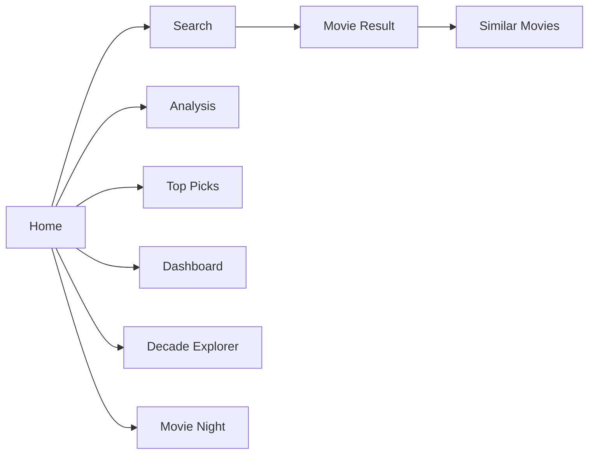
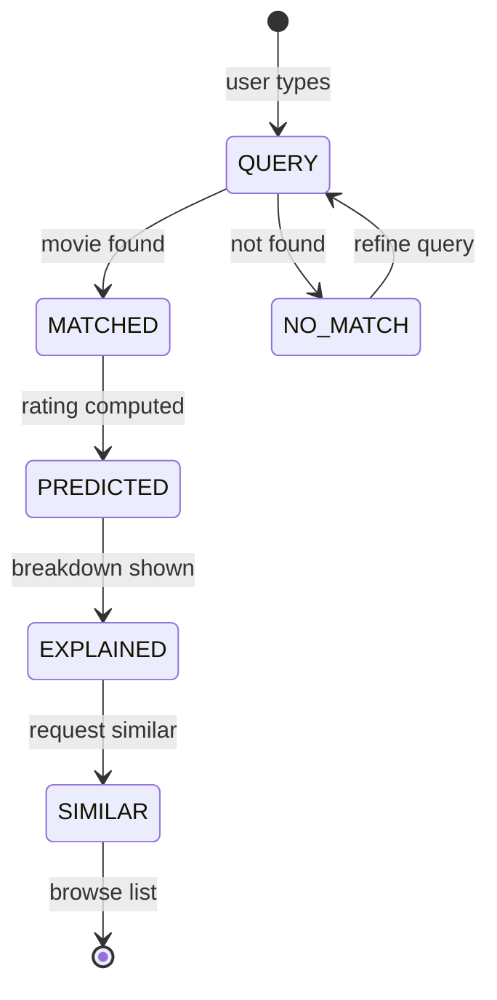
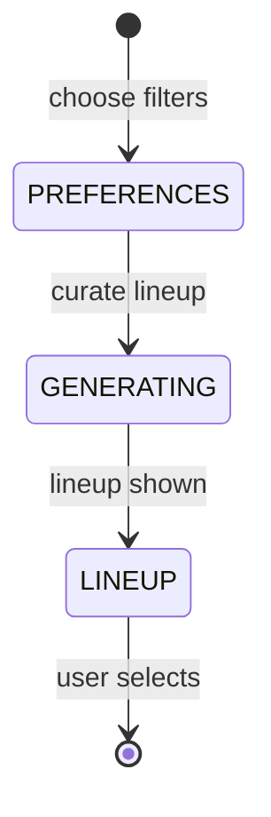

# AppFlow — MovieLens AI: Application Flow

| Field | Value |
| --- | --- |
| Version | v0.1 |
| Last Updated | 2026-08-06 |
| Owner | PM / QA |
| Status | In Review |

---

## 1. Screen Inventory

| SCR-### | Screen | Purpose | Entry | Exit | Auth |
| --- | --- | --- | --- | --- | --- |
| SCR-001 | Search | Movie lookup + rating | nav | results | No |
| SCR-002 | Movie Result | Prediction + breakdown | search | similar | No |
| SCR-003 | Similar Movies | Recommendation list | result | result | No |
| SCR-004 | Analysis | Genre/rating/similarity charts | nav | — | No |
| SCR-005 | Top Picks | Highest-rated by genre | nav | result | No |
| SCR-006 | Dashboard | Ratings, watchlist, stats | nav | — | No |
| SCR-007 | Decade Explorer | Decade + genre trends | nav | — | No |
| SCR-008 | Movie Night | Marathon lineup | nav | — | No |

## 2. Navigation Map

## 3. Detailed Flow per Journey

### Discover a movie

### Movie night

## 4. Empty / Loading / Error States

| Screen | Empty | Loading | Error |
| --- | --- | --- | --- |
| Search | "No results" | spinner | dataset error |
| Similar | "No similar" | — | cold-start note |
| Dashboard | "No ratings yet" | — | — |
| Analysis | "No data" | chart loading | — |

## 5. Edge Cases & Branching Logic

| IF condition | THEN route |
| --- | --- |
| Movie not in dataset | No-results message |
| No tags for movie | Weight renormalization |
| New movie (no ratings) | Metadata-based fallback |
| Large query set | Paginate/limit |

## 6. Notifications & Re-engagement

N/A — no push notifications in v1.

## 7. Cross-Platform Deltas

N/A — web app only.

## 8. Related Documents

| Document | Relationship |
| --- | --- |
| [PRD.md](../product/PRD.md) | US-001…008 |
| [TechSpec.md](../technical/TechSpec.md) | Components |
| [Design.md](Design.md) | Screens |
| [Schema.md](../technical/Schema.md) | Data |
| [ImplementationPlan.md](../project/ImplementationPlan.md) | Tasks |
| [Tracker.md](../project/Tracker.md) | Status |
| [Rules.md](../project/Rules.md) | Standards |
| [API.md](../technical/API.md) | Interfaces |
| [SecurityAndCompliance.md](../technical/SecurityAndCompliance.md) | Data |
| [Testing.md](../technical/Testing.md) | Tests |
| [Deployment.md](../technical/Deployment.md) | Env |
| [Glossary.md](../reference/Glossary.md) | Vocabulary |
| [RiskRegister.md](../project/RiskRegister.md) | Risks |
