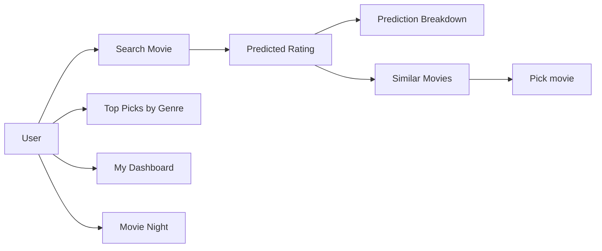

# PRD — MovieLens AI (Next-Gen-Reco): Movie Rating & Recommendation App

| Field | Value |
| --- | --- |
| Version | v0.1 |
| Last Updated | 2026-08-06 |
| Owner | Product Manager |
| Status | In Review |

---

## 1. Executive Summary

MovieLens AI is a Streamlit web app that predicts movie ratings and generates content-based recommendations using the MovieLens 32M dataset. Users search movies for predicted ratings, find similar movies via a hybrid similarity engine (genre 50%, tags 20%, year 10%, rating boost 20%), explore analyses (genre distribution, rating comparison, similarity breakdown), browse top picks by genre, track personal ratings/watchlists in a dashboard, explore movies by decade, and generate curated "Movie Night" marathons. Powered by Random Forest + XGBoost rating prediction.

## 2. Problem Statement

- **User pain:** With 87K movies, choosing what to watch and predicting whether you'll like a movie is hard.
- **Evidence/context:** Trained on 32M ratings, 2M tags, 87K movies; hybrid similarity engine with explainable per-feature breakdowns.
- **Cost of not solving it:** Decision paralysis, disappointing picks, no personalized discovery.

## 3. Goals & Non-Goals

| Goal | Metric | Target |
| --- | --- | --- |
| Accurate rating prediction | RMSE | ≤ 0.85 (target) |
| Relevant similar movies | Qualitative + feedback | ≥ 4/5 (target) |
| Explainability | Prediction breakdown shown | 100% of predictions |
| Engagement | Sessions with watchlist/dashboard | ≥ 50% (target) |

### Non-Goals (v1)
- Collaborative user-to-user filtering (content-based only).
- Live streaming / playback.
- Multi-user accounts with server persistence (local dashboard state).
- Real-time web-scale serving (single-app tool).

## 4. Target Users & Personas

| Persona | Role | Goals | Frustrations | Quote | Tech Comfort |
| --- | --- | --- | --- | --- | --- |
| Neha — Movie Fan | Finds films to watch | Good picks fast | Endless scrolling | "What should I watch tonight?" | Low |
| Arvind — Data Enthusiast | Explores the data | See patterns | Opaque models | "Show me why you recommend this." | Medium |
| Prof. Rao — Educator | Teaches recsys | Interactive examples | Static demos | "A live demo makes it click." | Medium |

## 5. User Stories

| ID | As a... | I want... | So that... | Priority | Acceptance Criteria |
| --- | --- | --- | --- | --- | --- |
| US-001 | Fan | search movies with predicted ratings | I get instant results | P0 | Search returns predictions |
| US-002 | Fan | similar movies | I find my next watch | P0 | Similar list with weights |
| US-003 | Fan | prediction breakdown | I trust the score | P1 | Feature contributions shown |
| US-004 | Fan | top picks by genre | I browse curated lists | P1 | Genre filter |
| US-005 | Fan | decade explorer | I explore eras | P2 | Decade + genre trends |
| US-006 | Fan | movie night generator | I get a marathon lineup | P2 | Curated lineup |
| US-007 | Fan | personal dashboard | I track my ratings | P1 | Watchlist + stats |
| US-008 | Analyst | analysis charts | I understand the data | P1 | Distribution + comparison |

## 6. Feature List

| ID | Epic | Feature | Description | Priority | Status |
| --- | --- | --- | --- | --- | --- |
| REQ-001 | Search | Movie search + rating prediction | Instant results | P0 | Done |
| REQ-002 | Recommend | Similar movies engine | Hybrid similarity | P0 | Done |
| REQ-003 | Explain | Prediction breakdown | Feature drivers | P1 | Done |
| REQ-004 | Analyze | Interactive charts | Genre/rating/similarity | P1 | Done |
| REQ-005 | Browse | Top picks by genre | Filtered highest-rated | P1 | Done |
| REQ-006 | Track | Personal dashboard | Ratings + watchlist | P1 | Done |
| REQ-007 | Explore | Decade explorer | Decade trends | P2 | Done |
| REQ-008 | Curate | Movie night | Marathon lineup | P2 | Done |

## 7. User Journeys (high level)

## 8. Success Metrics / KPIs

| Metric | Target | Measurement |
| --- | --- | --- |
| North Star: picks that satisfy | ≥ 4/5 qualitative (target) | feedback |
| Prediction RMSE | ≤ 0.85 (target) | eval on held-out |
| Search latency | < 1s | app timing |
| Feature coverage | 32M ratings used | dataset load |

## 9. Assumptions & Dependencies

- MovieLens 32M dataset available locally (`data/`).
- Trained model artifacts in `models/v1_test/`.
- Streamlit deployment (nextgenreco.streamlit.app).

## 10. Risks

Top 3 (full list in ../project/RiskRegister.md):
1. **Dataset size/load time** — mitigated by preprocessed artifacts + caching.
2. **Content-only limitation** — mitigated by explainable hybrid weights.
3. **Cold start (new movies)** — mitigated by metadata fallbacks.

## 11. Release Criteria

- [ ] Search returns predictions for any movie.
- [ ] Similar-movie engine produces sensible lists.
- [ ] Prediction breakdown renders.
- [ ] All 8 pages work.
- [ ] App deploys to Streamlit Cloud.

## 12. Open Questions

| Question | Owner | Resolve by |
| --- | --- | --- |
| Add collaborative filtering (user-user)? | PM | Release 2.0 |
| Server-side user accounts? | PM | Release 2.0 |

## 13. Related Documents

| Document | Relationship |
| --- | --- |
| [TechSpec.md](../technical/TechSpec.md) | Architecture, stack |
| [AppFlow.md](../design/AppFlow.md) | Page flows |
| [Design.md](../design/Design.md) | Design system |
| [Schema.md](../technical/Schema.md) | Data model |
| [ImplementationPlan.md](../project/ImplementationPlan.md) | Build plan |
| [Tracker.md](../project/Tracker.md) | Task status |
| [Rules.md](../project/Rules.md) | Standards |
| [API.md](../technical/API.md) | Interfaces |
| [SecurityAndCompliance.md](../technical/SecurityAndCompliance.md) | Data handling |
| [Testing.md](../technical/Testing.md) | Tests |
| [Deployment.md](../technical/Deployment.md) | Deployment |
| [Glossary.md](../reference/Glossary.md) | Vocabulary |
| [RiskRegister.md](../project/RiskRegister.md) | Risks |
