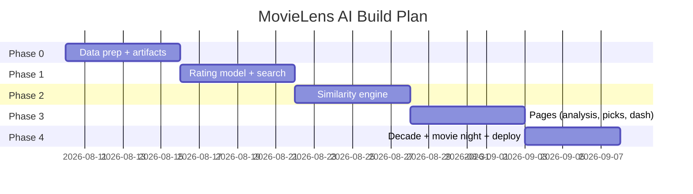
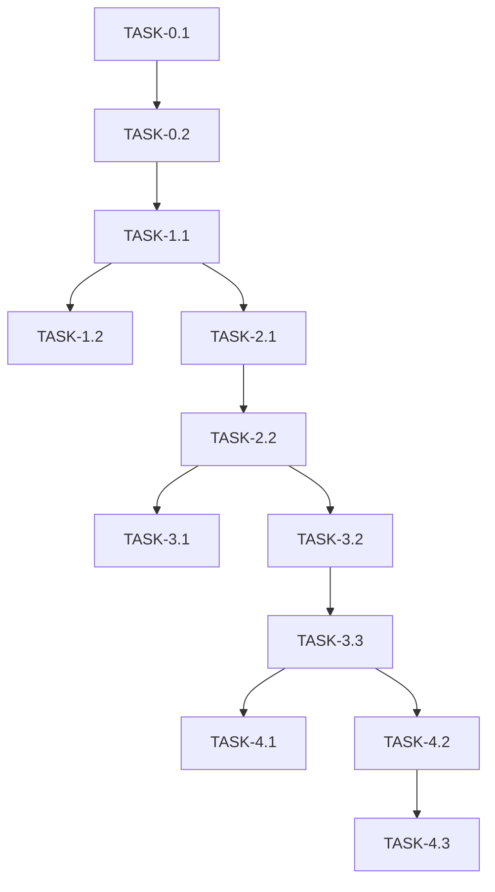

# ImplementationPlan — MovieLens AI: Phased Build Plan

| Field | Value |
| --- | --- |
| Version | v0.1 |
| Last Updated | 2026-08-06 |
| Owner | Engineering Lead |
| Status | In Review |

---

## 1. Build Philosophy

Data-first, explainable: load + preprocess the dataset, train rating model, build the hybrid similarity engine, then wrap in Streamlit pages. Every recommendation must be explainable.

## 2. Phase Overview

## 3. Phase Breakdown

### Phase 0: Data
- Goal: preprocessed artifacts from 32M ratings.
- Exit: data loads in < 60s.

| TASK-# | Description | Depends on | Owner | Est. | Maps to |
| --- | --- | --- | --- | --- | --- |
| TASK-0.1 | Download + preprocess MovieLens | — | Data | 4d | REQ-001 |
| TASK-0.2 | Cache artifacts + schema | TASK-0.1 | Data | 2d | [Schema.md](../technical/Schema.md) |

### Phase 1: Model + Search
- Goal: RF/XGBoost rating + search.
- Exit: predictions for any movie.

| TASK-# | Description | Depends on | Owner | Est. | Maps to |
| --- | --- | --- | --- | --- | --- |
| TASK-1.1 | Train RF/XGBoost | TASK-0.2 | ML | 3d | REQ-001 |
| TASK-1.2 | Search UI + breakdown | TASK-1.1 | FE | 3d | REQ-001, REQ-003 |

### Phase 2: Similarity
- Goal: hybrid similar-movie engine.
- Exit: sensible lists with weights.

| TASK-# | Description | Depends on | Owner | Est. | Maps to |
| --- | --- | --- | --- | --- | --- |
| TASK-2.1 | Genre/tag/year/rating fusion | TASK-1.1 | ML | 4d | REQ-002 |
| TASK-2.2 | Similar UI | TASK-2.1 | FE | 2d | REQ-002 |

### Phase 3: Pages
- Goal: analysis, top picks, dashboard.
- Exit: all pages render.

| TASK-# | Description | Depends on | Owner | Est. | Maps to |
| --- | --- | --- | --- | --- | --- |
| TASK-3.1 | Analysis charts | TASK-2.2 | FE | 2d | REQ-004 |
| TASK-3.2 | Top picks by genre | TASK-2.2 | FE | 2d | REQ-005 |
| TASK-3.3 | Dashboard | TASK-3.2 | FE | 2d | REQ-006 |

### Phase 4: Extras + Deploy
- Goal: decade explorer, movie night, cloud deploy.

| TASK-# | Description | Depends on | Owner | Est. | Maps to |
| --- | --- | --- | --- | --- | --- |
| TASK-4.1 | Decade explorer | TASK-3.3 | FE | 2d | REQ-007 |
| TASK-4.2 | Movie night | TASK-3.3 | FE | 2d | REQ-008 |
| TASK-4.3 | Streamlit Cloud deploy | TASK-4.2 | DevOps | 1d | — |

## 4. Dependency Graph

## 5. Environment & Tooling Setup Checklist

- [ ] `pip install -r requirements.txt`
- [ ] Download MovieLens 32M to `data/`
- [ ] Train artifacts → `models/v1_test/`
- [ ] `streamlit run app.py`

## 6. Rollout Strategy

- Single-app deploy; Streamlit Cloud auto.
- Rollback: revert commit / artifact.

## 7. Definition of Done (global)

- [ ] Tests pass
- [ ] Docs updated (this suite)
- [ ] Reviewed
- [ ] No secrets
- [ ] Manual smoke: search + similar + pages

## 8. Related Documents

| Document | Relationship |
| --- | --- |
| [PRD.md](../product/PRD.md) | REQ mapping |
| [TechSpec.md](../technical/TechSpec.md) | Components |
| [AppFlow.md](../design/AppFlow.md) | Flows |
| [Schema.md](../technical/Schema.md) | Data |
| [Design.md](../design/Design.md) | UI tasks |
| [Tracker.md](Tracker.md) | Status |
| [Rules.md](Rules.md) | Standards |
| [API.md](../technical/API.md) | Interfaces |
| [SecurityAndCompliance.md](../technical/SecurityAndCompliance.md) | Data |
| [Testing.md](../technical/Testing.md) | Tests |
| [Deployment.md](../technical/Deployment.md) | Deploy |
| [Glossary.md](../reference/Glossary.md) | Vocabulary |
| [RiskRegister.md](RiskRegister.md) | Risks |
