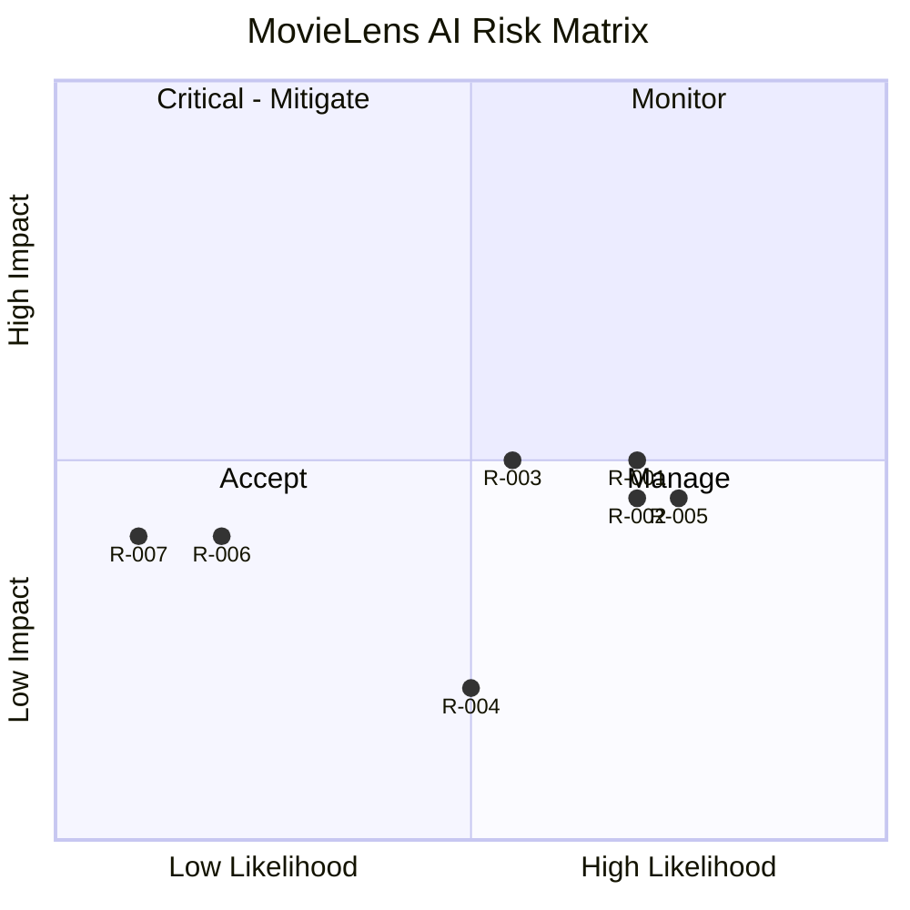

# RiskRegister — MovieLens AI: Known Risks

| Field | Value |
| --- | --- |
| Version | v0.1 |
| Last Updated | 2026-08-06 |
| Owner | PM / Eng Lead |
| Status | In Review |

---

| Risk | Likelihood | Impact | Score | Mitigation | Owner | Status |
| --- | --- | --- | --- | --- | --- | --- |
| R-001 Dataset load time/memory | High | Medium | 4 | Preprocessed artifacts + caching | Data | Mitigating |
| R-002 Content-only limitation | High | Medium | 4 | Explainable hybrid weights | ML | Accepted |
| R-003 Cold start | Medium | Medium | 4 | Metadata fallbacks | ML | Open |
| R-004 Model staleness | Medium | Low | 2 | Retrain script | ML | Open |
| R-005 No automated tests | High | Medium | 4 | Establish pytest (Testing.md) | QA | 🔴 Open |
| R-006 Streamlit Cloud limits | Low | Medium | 3 | Docker fallback | DevOps | Accepted |
| R-007 Dataset license misuse | Low | Medium | 3 | Research-use compliance note | PM | Mitigating |

## Risk Matrix

## Related Documents

| Document | Relationship |
| --- | --- |
| [PRD.md](../product/PRD.md) | Top-3 risks |
| [TechSpec.md](../technical/TechSpec.md) | R-001 |
| [SecurityAndCompliance.md](../technical/SecurityAndCompliance.md) | R-007 |
| [AppFlow.md](../design/AppFlow.md) | Flows |
| [Design.md](../design/Design.md) | Design |
| [Schema.md](../technical/Schema.md) | Data |
| [ImplementationPlan.md](ImplementationPlan.md) | Mitigations |
| [Tracker.md](Tracker.md) | R-005 |
| [Rules.md](Rules.md) | Standards |
| [API.md](../technical/API.md) | Interfaces |
| [Testing.md](../technical/Testing.md) | R-005 |
| [Deployment.md](../technical/Deployment.md) | R-006 |
| [Glossary.md](../reference/Glossary.md) | Vocabulary |
