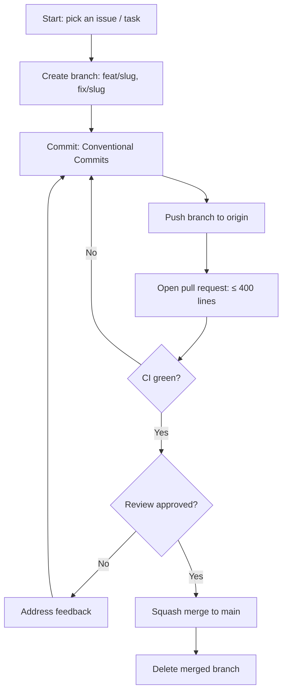

# Rules — MovieLens AI: Coding Standards & AI-Agent Operating Rules

| Field | Value |
| --- | --- |
| Version | v0.1 |
| Last Updated | 2026-08-06 |
| Owner | Engineering Lead |
| Status | In Review |

---

## 1. Guiding Principles

1. Explainable recommendations only.
2. Readability over cleverness.
3. No silent failures — errors surfaced in UI.
4. Small PRs only.
5. Tests accompany behavior changes.
6. Data-load performance is a feature.

## 2. Code Style

- Python 3.10+, type hints.
- Formatter: black; linter: ruff.
- Structure:

```
app.py              # Streamlit entry
recommender.py      # similarity engine
scripts/            # training utilities
models/v1_test/     # model artifacts
data/               # dataset files
tests/
docs/
```

## 3. Git Workflow

- Branches: `feat/<slug>`, `fix/<slug>`.
- Commits: Conventional Commits.
- PRs: ≤ 400 lines; CI green.
- Merge: squash to main.

## 4. Testing Requirements

- Coverage ≥ 50%.
- MUST have tests: similarity weights, prediction bounds, search.
- See [Testing.md](../technical/Testing.md).

## 5. AI Agent Operating Rules

- Always read Tracker.md and ImplementationPlan.md before starting.
- Never mark a task 🟢 Done without tests passing.
- Never invent requirements not in ../product/PRD.md/../technical/TechSpec.md — flag ambiguity.
- Never commit secrets.
- State conflicts rather than silently picking one.

## 6. Security Baseline Rules

- No secrets in repo.
- Input validation on search.
- Dependency scans weekly.

## 7. Documentation Rules

- New pages → ../design/AppFlow.md same PR.
- New features → ../product/PRD.md same PR.

## 8. Prohibited Patterns

| Anti-pattern | Why |
| --- | --- |
| Opaque black-box recs | Explainability principle |
| Loading full 32M into memory repeatedly | Perf |
| Hardcoded data paths | Portability |
| Blanket except | Hides failures |

## 9. Escalation Rules

**Ask a human when:** dataset license changes, model retraining decisions.
**Decide autonomously:** UI polish, tests, weight tuning.

## Git / PR Workflow



## 10. Related Documents

| Document | Relationship |
| --- | --- |
| [Testing.md](../technical/Testing.md) | Test requirements |
| [SecurityAndCompliance.md](../technical/SecurityAndCompliance.md) | Security |
| [PRD.md](../product/PRD.md) | Requirements |
| [TechSpec.md](../technical/TechSpec.md) | Architecture |
| [AppFlow.md](../design/AppFlow.md) | Flows |
| [Design.md](../design/Design.md) | Design |
| [Schema.md](../technical/Schema.md) | Data |
| [ImplementationPlan.md](ImplementationPlan.md) | Tasks |
| [Tracker.md](Tracker.md) | Status |
| [API.md](../technical/API.md) | Interfaces |
| [Deployment.md](../technical/Deployment.md) | Env vars |
| [Glossary.md](../reference/Glossary.md) | Vocabulary |
| [RiskRegister.md](RiskRegister.md) | Risks |
