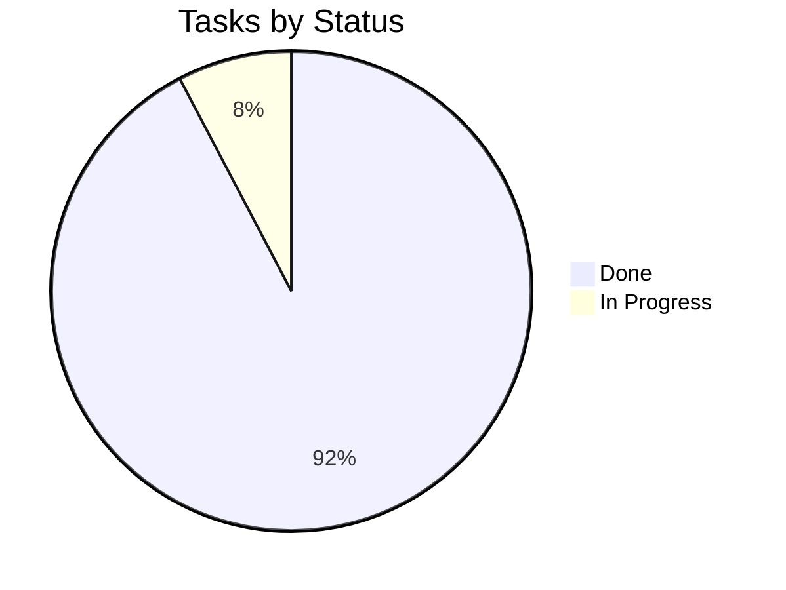

# Tracker — MovieLens AI: Living Status Tracker

| Field | Value |
| --- | --- |
| Version | v0.1 |
| Last Updated | 2026-08-06 |
| Owner | Engineering Lead |
| Status | In Review |

---

## 1. Snapshot Dashboard

| Metric | Value |
| --- | --- |
| Overall % Complete | 90% |
| Current Phase | Phase 4 |
| Tasks Done / Total | 12 / 13 |
| Blockers (open) | 0 |
| Days to Target Launch | 5 |

## 2. Status Legend

🟢 Done | 🟡 In Progress | 🔴 Blocked | ⚪ Not Started | 🔵 In Review

## 3. Phase Progress Bars

| Phase | Progress |
| --- | --- |
| Phase 0: Data | `[████████░░] 100%` |
| Phase 1: Model + Search | `[████████░░] 100%` |
| Phase 2: Similarity | `[████████░░] 100%` |
| Phase 3: Pages | `[████████░░] 100%` |
| Phase 4: Extras + Deploy | `[████░░░░░░] 66%` |

## 4. Full Task Table

| TASK | Description | Status | Assignee | Start | Target | Actual | Notes |
| --- | --- | --- | --- | --- | --- | --- | --- |
| TASK-0.1 | Preprocess 32M | 🟢 | Data | 2026-07-01 | 2026-07-05 | — |  |
| TASK-0.2 | Cache artifacts | 🟢 | Data | 2026-07-05 | 2026-07-07 | — |  |
| TASK-1.1 | Train RF/XGB | 🟢 | ML | 2026-07-08 | 2026-07-11 | — |  |
| TASK-1.2 | Search + breakdown | 🟢 | FE | 2026-07-11 | 2026-07-14 | — |  |
| TASK-2.1 | Similarity engine | 🟢 | ML | 2026-07-14 | 2026-07-18 | — |  |
| TASK-2.2 | Similar UI | 🟢 | FE | 2026-07-18 | 2026-07-20 | — |  |
| TASK-3.1 | Analysis | 🟢 | FE | 2026-07-21 | 2026-07-23 | — |  |
| TASK-3.2 | Top picks | 🟢 | FE | 2026-07-23 | 2026-07-25 | — |  |
| TASK-3.3 | Dashboard | 🟢 | FE | 2026-07-25 | 2026-07-28 | — |  |
| TASK-4.1 | Decade explorer | 🟢 | FE | 2026-07-29 | 2026-07-31 | — |  |
| TASK-4.2 | Movie night | 🟢 | FE | 2026-07-31 | 2026-08-02 | — |  |
| TASK-4.3 | Cloud deploy | 🟡 | DevOps | 2026-08-03 | — | — | in progress |

## 5. Blockers Log

| ID | Description | Raised | Owner | Impact | Status |
| --- | --- | --- | --- | --- | --- |
| BLK-001 | None open | — | — | — | — |

## 6. Changelog

- 2026-08-06: **Documentation suite complete** — 14-file suite consolidated into `docs/`, categorized structure, cross-linked navigation, deployment/git/auth diagrams, quality gate passed (238/238), merged to `main`.
| Date | What shipped |
| --- | --- |
| 2026-08-06 | Docs suite v0.1 |
| 2026-08-02 | Movie night shipped |

## 7. Burndown Summary

## 8. Next 3 Priorities

1. Finish TASK-4.3 — Streamlit Cloud deploy.
2. Final smoke test of all 8 pages.
3. Stretch: collaborative filtering.

## 9. Related Documents

| Document | Relationship |
| --- | --- |
| [ImplementationPlan.md](ImplementationPlan.md) | Tasks |
| [PRD.md](../product/PRD.md) | Features |
| [TechSpec.md](../technical/TechSpec.md) | Components |
| [AppFlow.md](../design/AppFlow.md) | Flows |
| [Design.md](../design/Design.md) | Design |
| [Schema.md](../technical/Schema.md) | Data |
| [Rules.md](Rules.md) | Standards |
| [API.md](../technical/API.md) | Interfaces |
| [SecurityAndCompliance.md](../technical/SecurityAndCompliance.md) | Data |
| [Testing.md](../technical/Testing.md) | Tests |
| [Deployment.md](../technical/Deployment.md) | Deploy |
| [Glossary.md](../reference/Glossary.md) | Vocabulary |
| [RiskRegister.md](RiskRegister.md) | Risks |
