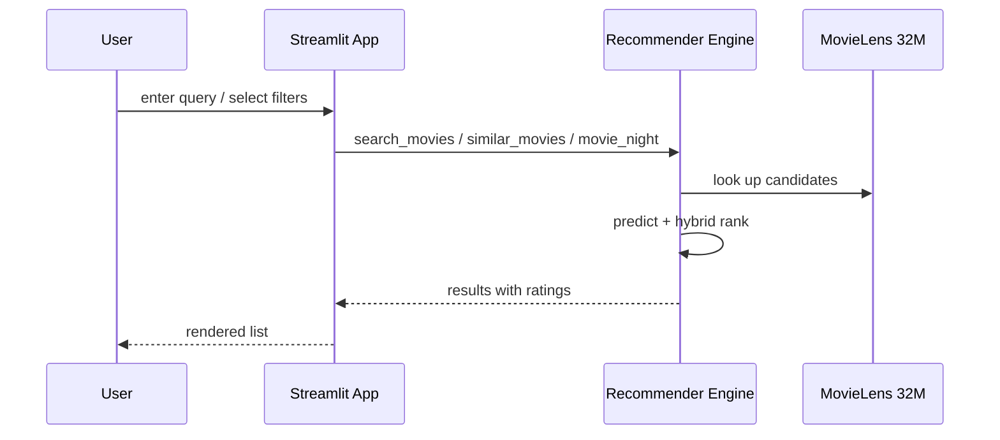

# API — MovieLens AI: Interfaces Reference

| Field | Value |
| --- | --- |
| Version | v0.1 |
| Last Updated | 2026-08-06 |
| Owner | Backend Engineer |
| Status | In Review |

---

> No public REST API in v1 — the app is Streamlit-only. This documents the internal function contracts the UI calls.

## 1. Function Contracts (recommender.py)

| Function | Purpose | Input → Output |
| --- | --- | --- |
| `search_movies(query)` | Search + predict | query → results with ratings |
| `predict_rating(movie)` | Rating prediction | movie → rating + breakdown |
| `similar_movies(movie)` | Hybrid similarity | movie → ranked list |
| `top_picks(genre)` | Highest-rated filter | genre → list |
| `decade_movies(decade)` | Decade filter | decade → list + trends |
| `movie_night(filters)` | Lineup generation | filters → lineup |

## 2. Example: similar_movies output

```json
{
  "movie": "Inception",
  "similars": [
    {"title": "Interstellar", "score": 0.91, "genre": 0.5, "tag": 0.21, "year": 0.1, "rating": 0.1}
  ]
}
```

## 3. Error Codes

| Code | Meaning | Retry? |
| --- | --- | --- |
| not_found | Movie not in dataset | Refine query |
| no_tags | Missing tag signal | Renormalize weights |
| artifact_missing | Model not trained | Run training |

## 4. Versioning Policy

- Function signatures versioned in code; UI is the only consumer.

## Request Flow (Streamlit-only — no REST API)



## 5. Related Documents

| Document | Relationship |
| --- | --- |
| [TechSpec.md](TechSpec.md) | Engine |
| [Schema.md](Schema.md) | Data contracts |
| [AppFlow.md](../design/AppFlow.md) | UI flows |
| [PRD.md](../product/PRD.md) | Requirements |
| [Design.md](../design/Design.md) | Rendering |
| [ImplementationPlan.md](../project/ImplementationPlan.md) | Tasks |
| [Tracker.md](../project/Tracker.md) | Status |
| [Rules.md](../project/Rules.md) | Standards |
| [SecurityAndCompliance.md](SecurityAndCompliance.md) | Data |
| [Testing.md](Testing.md) | Contract tests |
| [Deployment.md](Deployment.md) | Deploy |
| [Glossary.md](../reference/Glossary.md) | Vocabulary |
| [RiskRegister.md](../project/RiskRegister.md) | Risks |
