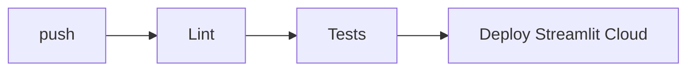

# Deployment — MovieLens AI: Environments, CI/CD, Rollback

| Field | Value |
| --- | --- |
| Version | v0.1 |
| Last Updated | 2026-08-06 |
| Owner | DevOps Engineer |
| Status | In Review |

---

## 1. Service Topology

| Service | Purpose | URL |
| --- | --- | --- |
| streamlit | App | nextgenreco.streamlit.app |

## 2. CI/CD Pipeline

## 3. Environment Promotion

| Step | From | To | Trigger |
| --- | --- | --- | --- |
| 1 | main | cloud | push (auto) |

## 4. Rollback Procedure

- Streamlit Cloud: revert commit.
- Artifact pinning for model files.

## 5. Feature Flags

- N/A — env-driven data/model paths.

## 6. On-Call / Runbook

- **Slow load:** check dataset caching.
- **Search errors:** verify artifacts exist.
- **Cloud memory:** Streamlit Cloud memory limits → optimize caching.

## 7. Related Documents

| Document | Relationship |
| --- | --- |
| [TechSpec.md](TechSpec.md) | Environments |
| [SecurityAndCompliance.md](SecurityAndCompliance.md) | Hosting |
| [PRD.md](../product/PRD.md) | Release criteria |
| [AppFlow.md](../design/AppFlow.md) | Flows |
| [Schema.md](Schema.md) | Artifacts |
| [Design.md](../design/Design.md) | Design |
| [ImplementationPlan.md](../project/ImplementationPlan.md) | Deploy task |
| [Tracker.md](../project/Tracker.md) | Status |
| [Rules.md](../project/Rules.md) | Standards |
| [API.md](API.md) | Interfaces |
| [Testing.md](Testing.md) | CI gates |
| [Glossary.md](../reference/Glossary.md) | Vocabulary |
| [RiskRegister.md](../project/RiskRegister.md) | Risks |
