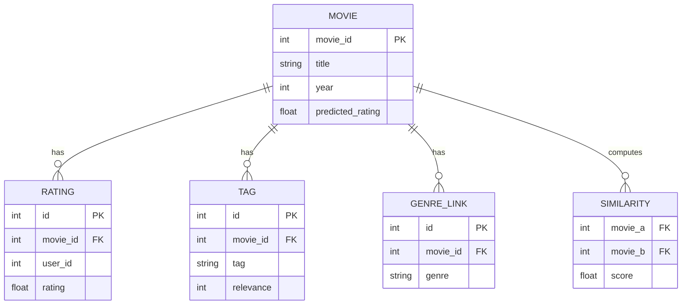

# Schema — MovieLens AI: Data Model

| Field | Value |
| --- | --- |
| Version | v0.1 |
| Last Updated | 2026-08-06 |
| Owner | Data Engineer |
| Status | In Review |

---

> Data lives in CSV/Parquet files (MovieLens 32M) loaded by pandas; no relational DB in v1.

## 1. ER Diagram



## 2. Table/Collection Definitions

### TBL-movie
| Field | Type | Nullable | Default | Constraints | Description |
| --- | --- | --- | --- | --- | --- |
| movie_id | int PK | No | — | unique | MovieLens id |
| title | string | No | — | — | title |
| year | int | Yes | — | — | release year |
| predicted_rating | float | Yes | — | 0..5 | model output |

### TBL-genre_link
| Field | Type | Nullable | Default | Constraints | Description |
| --- | --- | --- | --- | --- | --- |
| id | int PK | No | auto | — | PK |
| movie_id | int FK | No | — | → movie | parent |
| genre | string | No | — | — | genre |

### TBL-tag
| Field | Type | Nullable | Default | Constraints | Description |
| --- | --- | --- | --- | --- | --- |
| id | int PK | No | auto | — | PK |
| movie_id | int FK | No | — | → movie | parent |
| tag | string | No | — | — | tag |
| relevance | int | Yes | — | — | tag weight |

## 3. Relationships

- movie 1:N genre_links, tags, ratings.
- similarity between movie pairs (computed).

## 4. Indexes

| Table | Index | Columns | Type | Reason |
| --- | --- | --- | --- | --- |
| movie | idx_movie_title | (title) | btree | search |
| genre_link | idx_genre_movie | (movie_id) | btree | genre vectors |
| tag | idx_tag_movie | (movie_id) | btree | tag vectors |

## 5. Enums / Constants

| Enum | Allowed values |
| --- | --- |
| similarity weights | genre 50%, tag 20%, year 10%, rating 20% |
| ratings scale | 0..5 |

## 6. Data Lifecycle

- Dataset static (MovieLens 32M); artifacts cached.
- No writes in v1.

## 7. Migrations

N/A — file-based data.

## 8. Sample Record

```json
{
  "movie": { "movie_id": 272, "title": "Batman Begins", "year": 2005, "predicted_rating": 4.2 },
  "genres": ["Action", "Adventure"],
  "tags": ["dark", "origin story"]
}
```

## 9. Data Validation Rules

| Field | Enforced where |
| --- | --- |
| predicted_rating | 0..5 (app) |
| genre | normalized list (app) |
| year | sane range (app) |

## 10. Sensitive Data Map

| Field | Sensitivity | Encrypted at rest? | Masked in logs? |
| --- | --- | --- | --- |
| movie data | none | no | no |
| ratings (user_ids) | pseudonymous | no | n/a (static) |

## 11. Related Documents

| Document | Relationship |
| --- | --- |
| [API.md](API.md) | Interfaces consuming data |
| [TechSpec.md](TechSpec.md) | Data loading |
| [PRD.md](../product/PRD.md) | Requirements |
| [AppFlow.md](../design/AppFlow.md) | Flows |
| [Design.md](../design/Design.md) | Display data |
| [ImplementationPlan.md](../project/ImplementationPlan.md) | Tasks |
| [Tracker.md](../project/Tracker.md) | Status |
| [Rules.md](../project/Rules.md) | Standards |
| [SecurityAndCompliance.md](SecurityAndCompliance.md) | Data |
| [Testing.md](Testing.md) | Data tests |
| [Deployment.md](Deployment.md) | Artifacts |
| [Glossary.md](../reference/Glossary.md) | Vocabulary |
| [RiskRegister.md](../project/RiskRegister.md) | Risks |
