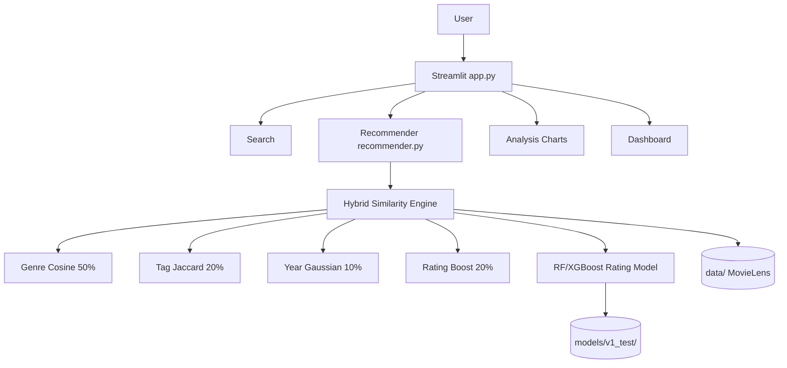
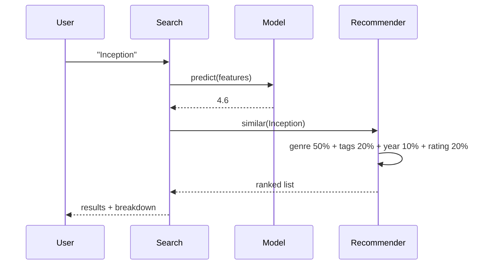
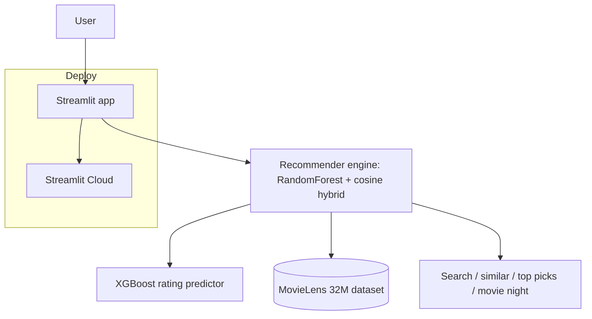
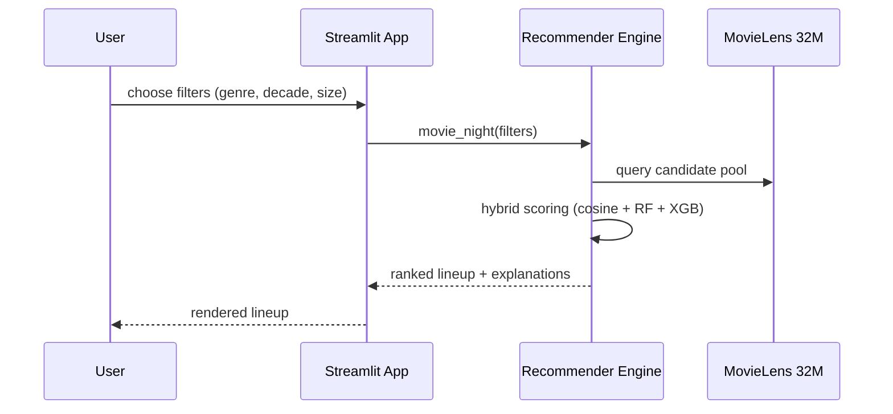

# TechSpec — MovieLens AI: Technical Specification

| Field | Value |
| --- | --- |
| Version | v0.1 |
| Last Updated | 2026-08-06 |
| Owner | Engineering Lead |
| Status | In Review |

---

## 1. Architecture Overview

## 2. Tech Stack Table

| Layer | Technology | Version | Justification |
| --- | --- | --- | --- |
| App | Streamlit | — | Fast interactive UI |
| Language | Python | 3.10 | ML ecosystem |
| ML | scikit-learn | — | Random Forest + cosine |
| Boost | XGBoost | — | Rating prediction |
| Data | pandas/numpy | — | 32M ratings processing |
| Dataset | MovieLens 32M | — | Rich signals |
| Deploy | Streamlit Cloud | — | nextgenreco.streamlit.app |

## 3. System Components

| Component | Responsibility | Inputs → Outputs | Scaling | Failure Modes |
| --- | --- | --- | --- | --- |
| Streamlit app | UI (8 surfaces) | user → widgets | single-app | session reset |
| Search | Movie lookup + prediction | query → results | in-process | no match |
| Recommender | Hybrid similarity | movie → similar | in-process | cold start |
| Similarity engine | Weighted fusion | features → scores | in-process | missing tags |
| Rating model | Predict avg rating | features → rating | in-process | artifact missing |
| Dashboard | Personal stats | state → UI | per-session | stale state |

## 4. Data Flow Diagrams

## 5. Third-Party Integrations

None — fully offline/local with bundled dataset + artifacts.

## 6. Non-Functional Requirements

| Category | Requirement | Target | How Verified |
| --- | --- | --- | --- |
| Performance | Search latency | < 1s | app timing |
| Accuracy | Prediction RMSE | ≤ 0.85 | held-out eval |
| Load time | App boot | < 60s (32M data) | CI/deploy |
| Portability | Runs locally + cloud | yes | docs |

## 7. Environments

| Env | URL | Data | Deploy |
| --- | --- | --- | --- |
| dev | localhost:8501 | local data/ | manual |
| cloud | nextgenreco.streamlit.app | bundled data | git push |

## 8. Error Handling Strategy

- Movie not found → clear "no results" state.
- Model artifact missing → guidance to train.
- Large data load → cached/preprocessed artifacts.

## 9. Observability

- Streamlit session logs; model load timings.

## 10. Technical Risks & Mitigations

| Risk | Mitigation |
| --- | --- |
| Dataset load memory | Preprocessed artifacts + caching |
| Cold start | Metadata fallbacks |
| Model staleness | Retrain script documented |

## Deployment Topology

## Sequence: Movie-Night Lineup

## 11. Related Documents

| Document | Relationship |
| --- | --- |
| [PRD.md](../product/PRD.md) | Requirements |
| [Schema.md](Schema.md) | Data model |
| [API.md](API.md) | Interfaces |
| [AppFlow.md](../design/AppFlow.md) | Flows |
| [Design.md](../design/Design.md) | UI |
| [ImplementationPlan.md](../project/ImplementationPlan.md) | Phases |
| [Tracker.md](../project/Tracker.md) | Status |
| [Rules.md](../project/Rules.md) | Standards |
| [SecurityAndCompliance.md](SecurityAndCompliance.md) | Data |
| [Testing.md](Testing.md) | Tests |
| [Deployment.md](Deployment.md) | Environments |
| [Glossary.md](../reference/Glossary.md) | Vocabulary |
| [RiskRegister.md](../project/RiskRegister.md) | Risks |
