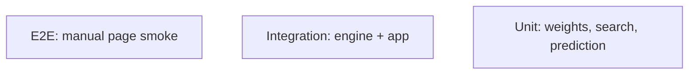

# Testing — MovieLens AI: Test Strategy

| Field | Value |
| --- | --- |
| Version | v0.1 |
| Last Updated | 2026-08-06 |
| Owner | QA Engineer |
| Status | In Review |

---

## 1. Test Pyramid

## 2. Strategy

| Layer | Tool | Scope |
| --- | --- | --- |
| Unit | pytest | Similarity weights, rating bounds, search |
| Integration | pytest | Engine ↔ app functions |
| E2E | Manual | 8-page smoke |

> Note: repo currently has NO_TESTS_COLLECTED — establish pytest suite per this plan.

## 3. Critical Test Cases

| ID | Feature | Case | Expected |
| --- | --- | --- | --- |
| TC-001 | Similarity | Weight fusion | genre 50% + tag 20% + year 10% + rating 20% |
| TC-002 | Prediction | Rating bounds | 0..5 |
| TC-003 | Search | Known movie | Result with prediction |
| TC-004 | Search | Unknown movie | No-results state |
| TC-005 | Top picks | Genre filter | Only genre matches |
| TC-006 | Movie night | Lineup generation | Valid lineup |
| TC-007 | Cold start | No tags | Weight renormalization |

## 4. Test Data Strategy

- Small MovieLens subset for speed; fixtures.

## 5. CI Gates

- `pytest` green (once established).
- Ruff lint.

## 6. Related Documents

| Document | Relationship |
| --- | --- |
| [Rules.md](../project/Rules.md) | Test requirements |
| [PRD.md](../product/PRD.md) | Release criteria |
| [TechSpec.md](TechSpec.md) | Components |
| [AppFlow.md](../design/AppFlow.md) | Flow tests |
| [Schema.md](Schema.md) | Data tests |
| [API.md](API.md) | Contract tests |
| [Design.md](../design/Design.md) | UI tests |
| [ImplementationPlan.md](../project/ImplementationPlan.md) | Test tasks |
| [Tracker.md](../project/Tracker.md) | Status |
| [SecurityAndCompliance.md](SecurityAndCompliance.md) | Security tests |
| [Deployment.md](Deployment.md) | CI gates |
| [Glossary.md](../reference/Glossary.md) | Vocabulary |
| [RiskRegister.md](../project/RiskRegister.md) | Risks |
